<h1>Memory management in Swift(Heap, Stack, ARC)</h1>
============================================

Swift sử dụng stack và heap để lưu trữ object. Quản lý bộ nhớ đề cập đến việc cấp phát và thu hồi một đối tượng.

Có hai mô hình quản lý bộ nhớ trong iOS.

1.  MRC : manual reference counting
2.  ARC: automatic reference counting

<h2>What is MRC?</h2>
------------

Ban đầu chúng ta đang sử dụng MRC mà không phải ARC, chúng ta cần giữ lại đối tượng và giải phóng đối tượng theo cách thủ công.

Trong mô hình này, chúng ta cần sử dụng 2 keywords đó là `retain` và `release` cho việc giữ object trong bộ nhớ và giải phón object khỏi bộ nhớ.

<h2>What is ARC?</h2>
------------

Hiện tại swift sử dụng ARC để tự động phân bổ và xử lý bộ nhớ. Với phương pháp này, bạn không cần phải sửa dụng `retain` và `release` nữa.

Khái niệm của ARC rất đơn giản, một đối tượng được giữ lại trong bộ nhớ bằng cách tăng lượng tham chiếu tới nó và sẽ được giải phóng khi giảm số lượng tham chiếu tới nó.

> Nếu số lượng tham chiếu trở thành 0, đối tượng đó sẽ được giải phóng khỏi bộ nhớ.

Trong swift, ta có 3 loại tham chiếu chính đó là  **strong**, **weak** and **unowned**.

<h2>Object's Lifetime</h2>
---------------------------

1.  **Allocation**: Lấy memory từ stack or heap.
2.  **Initialization**: `init` được chạy.
3.  **Usage**: Object được sử dụng.
4.  **Deinitialization**: `deinit` được chạy.
5.  **Deallocation**: Trả lại memory cho stack or heap.

<h2>Memory management issues</h2>
----------------------------------

1.  Giải phóng hoặc ghi đè dữ liệu khi đối tượng đang sử dụng. Nó gây ra crash or data corruption.
2.  Không giải phóng đối tượng nếu nó không được sử dụng. Nó dẫn đến memory leak.
3.  App crashes.

<h2>Memory leak</h2>
--------------------

Khi bộ nhớ được phân bổ cho đối tượng không được giải phóng mặc dù đối tượng sẽ không bao giờ được sử dụng lại, nó được gọi là memory leak. Nó xảy ra khi hai đối tượng tham chiếu lẫn nhau, khiến cho việc không thể bị giải phóng.

Memory leak trong ứng dụng gây ra hiệu suất hệ thống kém do tăng số lượng bộ nhớ.

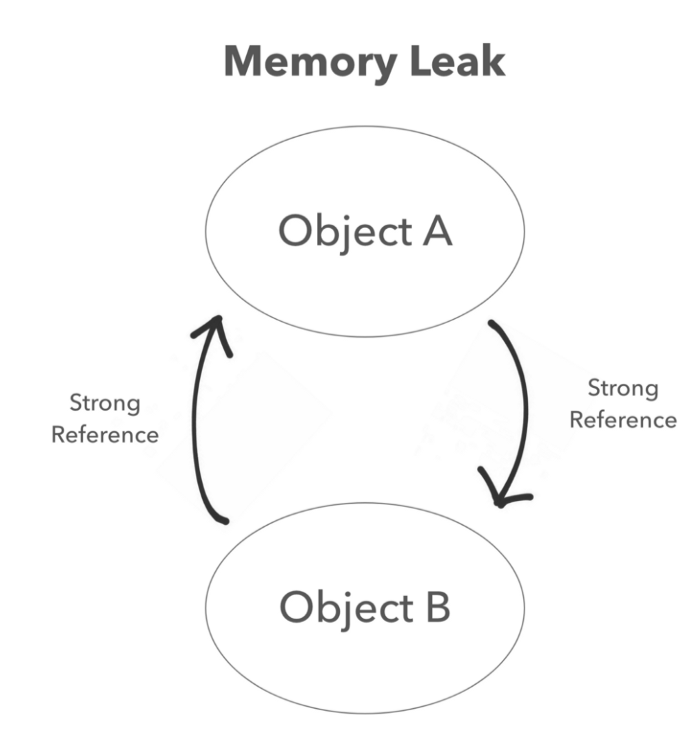

<h2>Quy tắc chính trong memory management</h2>
-----------------------------------------

1.  Khi tạo đối tượng thì sau đó phải giải phóng đối tượng khi không sử dụng nữa.
2.  Sử dụng retain count để giải phóng và lưu trữ object trong bộ nhớ.
3.  Đừng giải phóng đối tượng nếu bạn không sở hữu đối tượng đó.

<h2>Làm thế nào đối tượng được lưu trữ và giải phóng trong bộ nhớ?</h2>
----------------------------------------------

**Strong references** sẽ làm tăng retain count, nó sẽ lớn hơn hoặc bằng 1, khi retain count bằng `zero`, object sẽ dược giải phóng khỏi bộ nhớ.

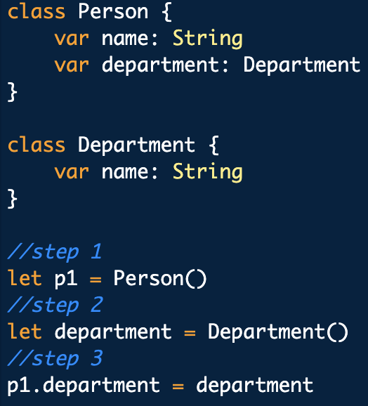

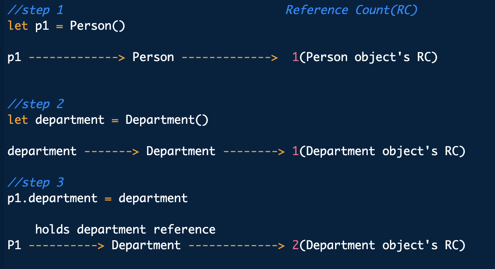

Ở ví dụ trên, ta tạo ra 2 class là person và department. Object Person được tạo và gán cho biến `p1` và Object Department được tạo và gán cho variable `department`.

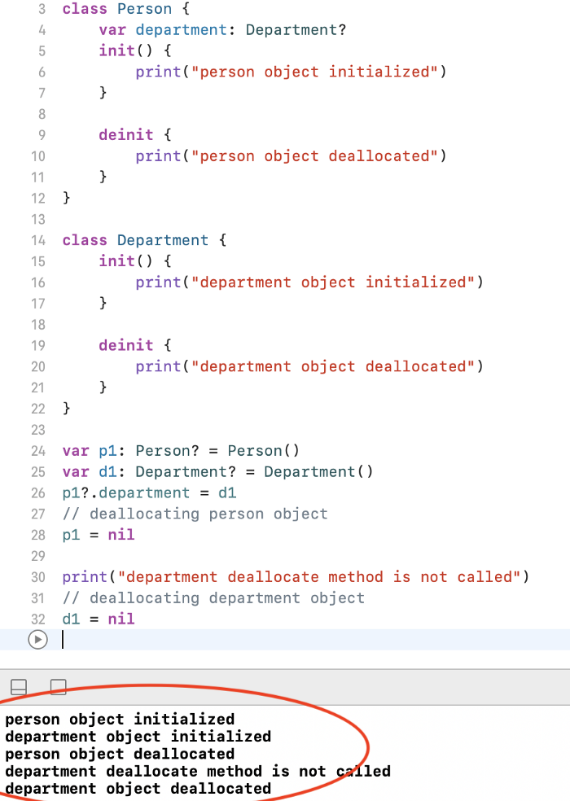

Khi đối tượng Person được giải phóng, nó cũng tự động giải phóng các sub object. Vì vậy reference count của department cũng giảm xuống còn 1 khi đối tượng Person được giải phóng.

Khi đối tượng Person được giải phóng, method deinit của nó được gọi là method deinit của Department không được gọi vì số lượng giữ lại không bằng `zero`. Sau khi derpartment được gán bằng nil, retain count của nó bằng `zero` và giải phóng khỏi bộ nhớ.

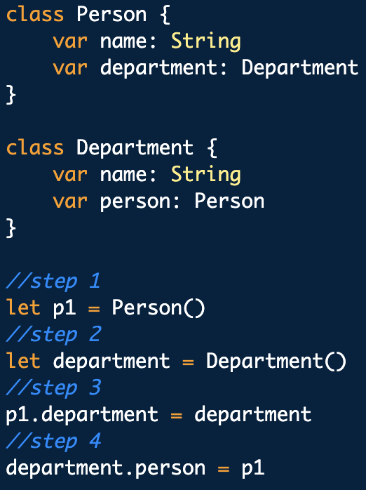

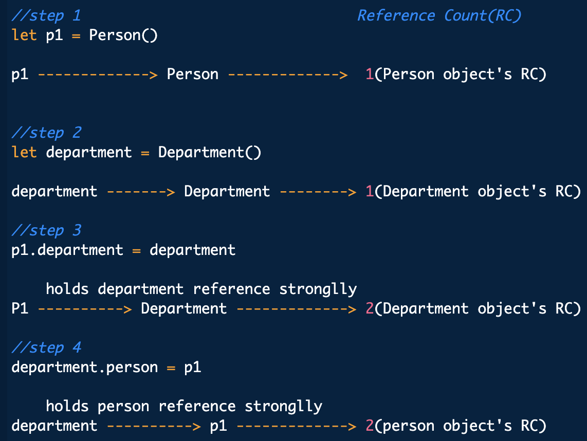

Trong ví dụ trên, ta tạo 1 `person` giữ 1 tham chiếu tới `department` của nó và `department` cũng tham chiếu tới `person`.

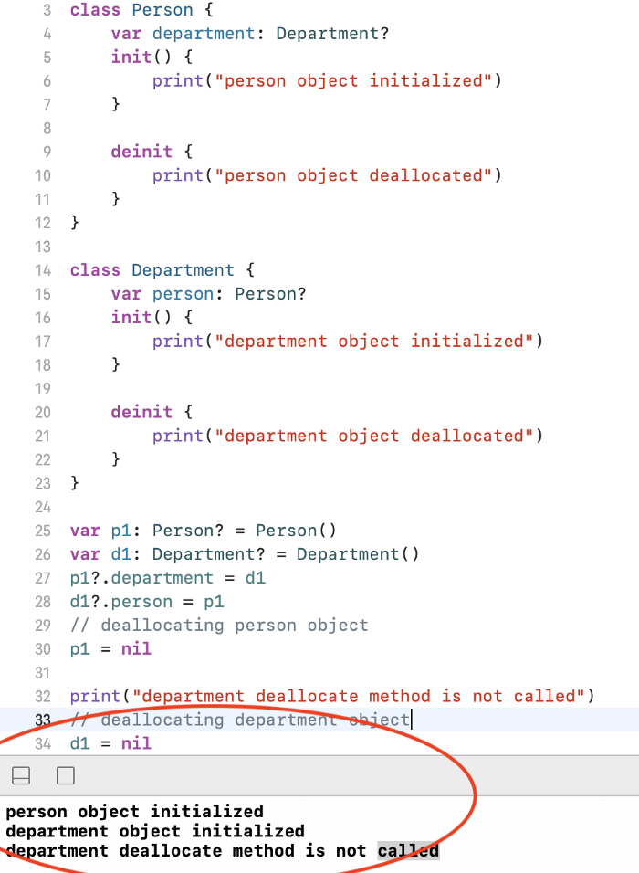

When person được gán bằng nil. retain count của nó là 1 và khi department dược gán là nil, retain count của nó là 1.

Trong trường hợp này, retain count của cả 2 object đều nhiều hơn 1 và cả 2 đều tham chiếu tới nhau, dẫn tới không thể được giải phóng. Nó dẫn đến rò rỉ bộ nhớ. Tình huống này được gọi là retain cycle.

> Khi view controller được xóa. tất cả các view controller object sẽ được giải phóng. Bất kỳ sub object nào của object cũng sẽ được giải phóng khí nó được giải phóng.
>
> Note: Nếu 1 lớp khác có strong reference tới một object trong class thí cả lớp đó sẽ không được giải phóng.
Vì vậy nên sử dụng weak or unowned prorperties.

<h2>Retain cycle là gì?</h2>
--------------------------------------

Retain cycle xải ra khi 2 đối tượng đang tham chiếu tới nhau, khiến cho không thể giả phóng đối tượng - vì retain count của chúng luôn lớn hơn hoặc bằng 1.

How can you fix retain cycle?
-----------------------------

Đổi 1 trong tham chiếu về `weak` or `unowned` reference.

**Weak Reference**: Nó không làm tăng số lượng tham chiếu. weak reference luốn được khai vào là **optional type**.

**Unowned References**: giống với weak reference. Nó sẽ không làm tăng retain count khi được tham chiếu tới. Sự khác biệt chính là nó không phải là **optional type**. Nếu truy cập đến unowned property của 1 object đã deinit. Sẽ xảy ra lỗi runtime khi bạn cố force unwarp nil optional type

It is same as weak references. It will not increase the retain count when object is referred. The main difference is, it never optional types. If you try to access an unowned property that refers to a deinitialized object, you'll trigger a runtime error comparable to force unwrapping a `nil` optional type.

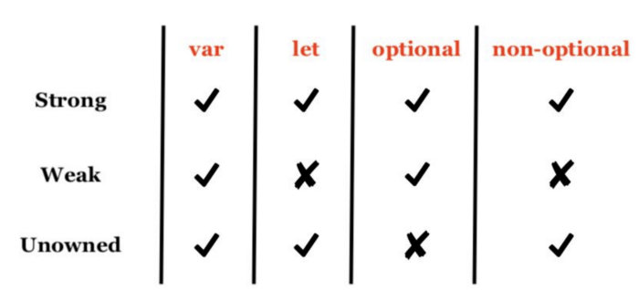

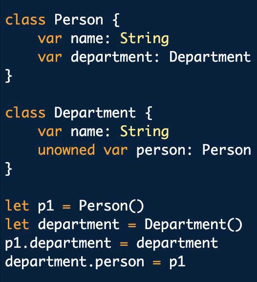

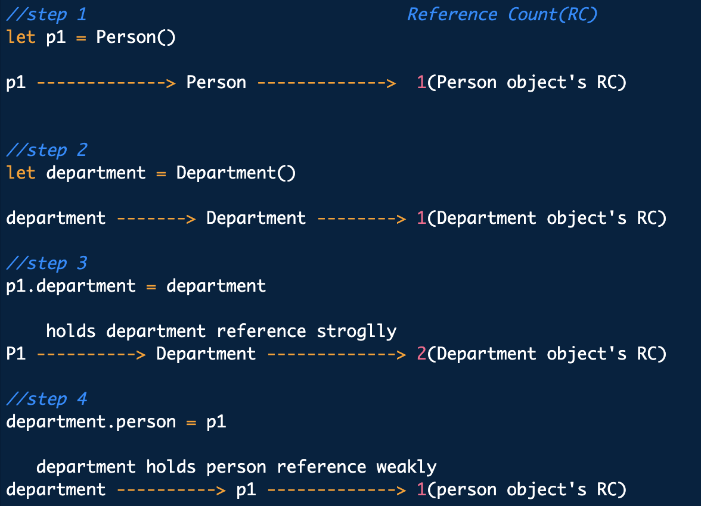

Trong ví dụ trên, bạn có thể giải quyết strong reference bằng cách thay đổi weak or unowned reference trong lớp department.

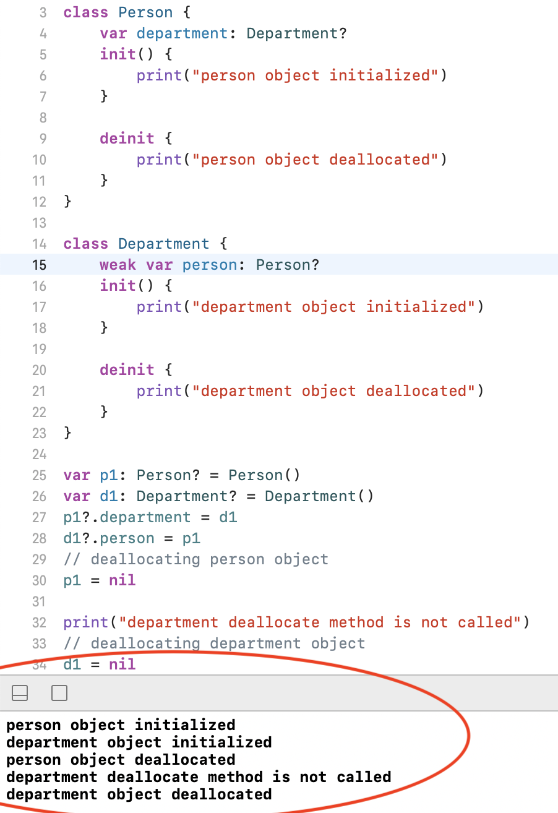

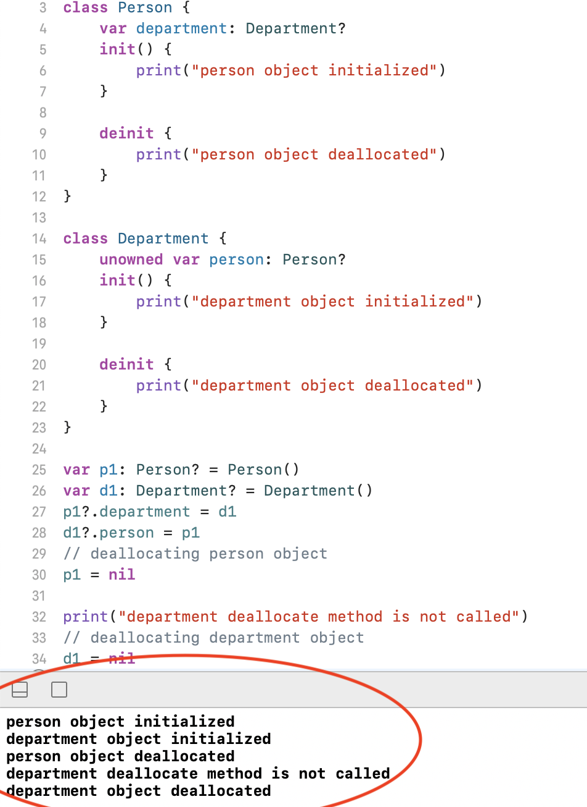

Strong Reference Cycle in Closures:
-----------------------------------

Khi bạn sử dụng closures trong 1 instance class, chúng có thể captrue **self**
When you use closures within a class instance they could potentially capture self. If self, in turn, retains that closure, you'd have a mutual strong reference cycle between closure and class instance.

To avoid it, you'd use the same keywords weak and unowned in closure capture list.

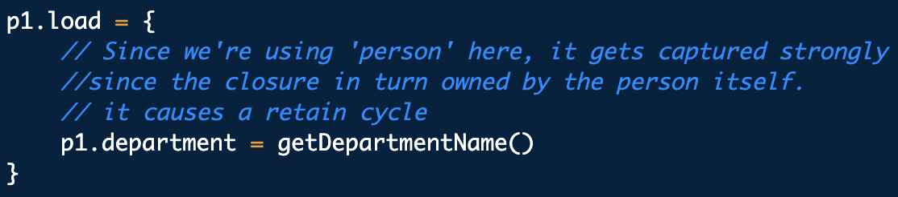

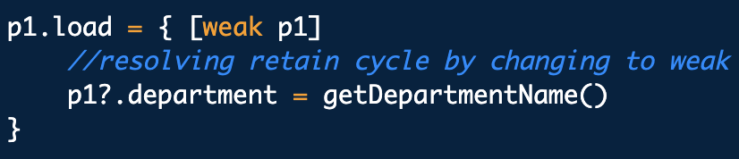

> To know more about closure and capture list please click [here](https://manasaprema04.medium.com/closures-f645d92fc524)

How can we identify memory leaks?
=================================

Xcode has a built in *memory graph debugger*. It allows you to see how many reference counts you have on an object and which objects currently exist.

Heaps and Stacks
----------------

Swift automatically allocates memory in either the heap or the stack.

Stack:
------

-   Static in memory and allocation happens only during compile time.
-   stack is LIFO(Last in first out) data structure
-   very fast access
-   When a function is called, all local instances in that function will be pushed on to the current stack. And once the function has returned, all instances will have been removed from the stack.
-   Data stored in the stack is only there temporarily until the function exits and causes all memory on the stack to be automatically deallocated.
-   Each "scope" in your app (like the inner contents of a method) will provide the amount of memory it needs.
-   stack is not used with objects that change in size.
-   Each thread has its own stack
-   Stacks store value types, such as structs and enums.
-   If the size of your value type can be determined during compile time, or if your value type doesn't recursively contains / is not contained by a reference type, then it will require stack allocation.
-   Value type doesn't increases retain count. But If your value type contains inner references, copying it will require increasing the reference count of it's children instead.

Heap:
-----

-   Dynamic in memory and allocation happens during runtime.
-   Values can be referenced at any time through a memory address.
-   no limit on memory size
-   slower access
-   When the process requests a certain amount of memory, the heap will search for a memory address that fulfils this request and return it to the process.
-   When the memory is not being used anymore, the process must tell the heap to free that section of memory.
-   It requires thread safety.
-   heap is shared with everybody
-   If the size of your value type cannot be determined during compile time (because of a protocol/generic requirement), or if your value type recursively contains / is contained by a reference type (remember that closures are also reference types), then it will require heap allocation.
-   class is stored in heap memory.

> Heap Allocation is slower than Stack Allocation not just because of the more complex data structure --- it also requires thread safety. Each thread has its own stack, but the heap is shared with everybody, demanding synchronization.

Interview tricky questions?
---------------------------

1\. What happens when we execute below code?

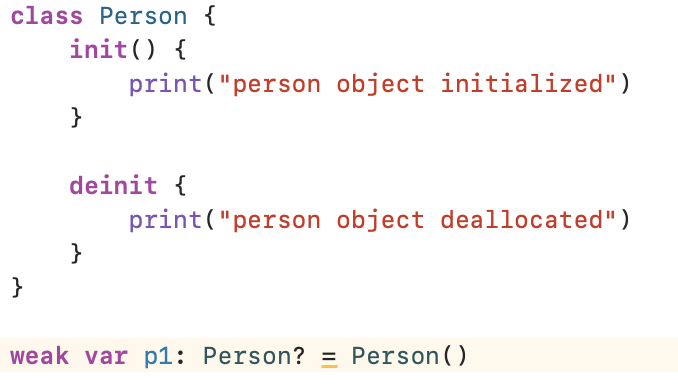

Ans: Object will be allocated and deallocated immediately and you can't refer that object again. Bellow is simple example:

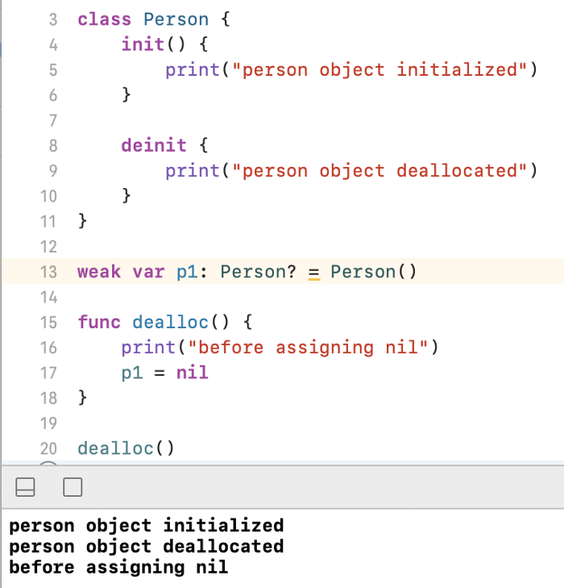

2\. Why IBOutlets are weak. What happen if you use strong references?

If you declare IBOutlets as strong or weak, your application won't crash and burn. Every view controller keeps a reference to the view it manages. That reference is strong. The view should not be deallocated as long as the view controller is alive.

That VC's view always keeps a strong reference to the subviews it manages. That makes sense because the subviews is still alive and visible even if we don't declare an outlet for the subviews in the `ViewController` class.

As per ARC: When the view controller is deallocated, the view it manages is deallocated as well. This also means that any subviews the view manages are also deallocated.

The view heirarchy already has a strong reference. so assigning weak to IBoutlets might help to avoid reference cycles when your dismissing the view controller.

As of 2015, recommended best practice from Apple was for IBOutlets to be strong unless weak is specifically needed to avoid a retain cycle.

Thank you for reading
=====================

This is my first article on Memory Management, I hope it will be useful for you. If you enjoyed it, feel free to hit the clap button below 👏 to help others find it! and follow me on [Medium](https://medium.com/@manasaprema04).