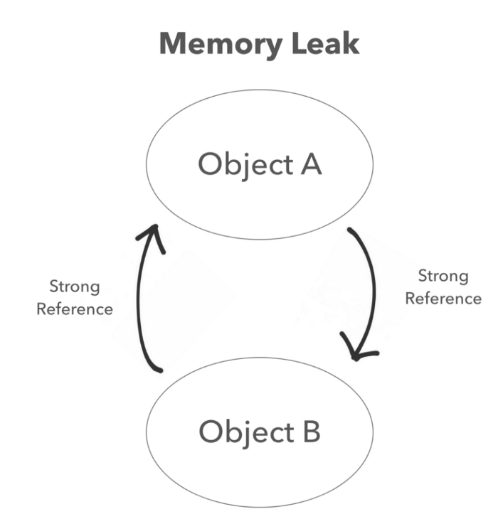
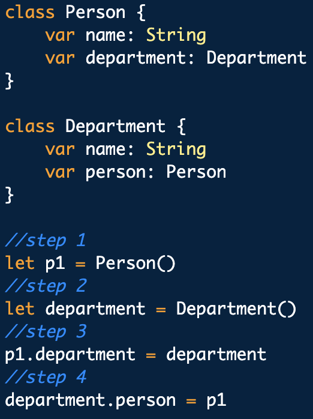
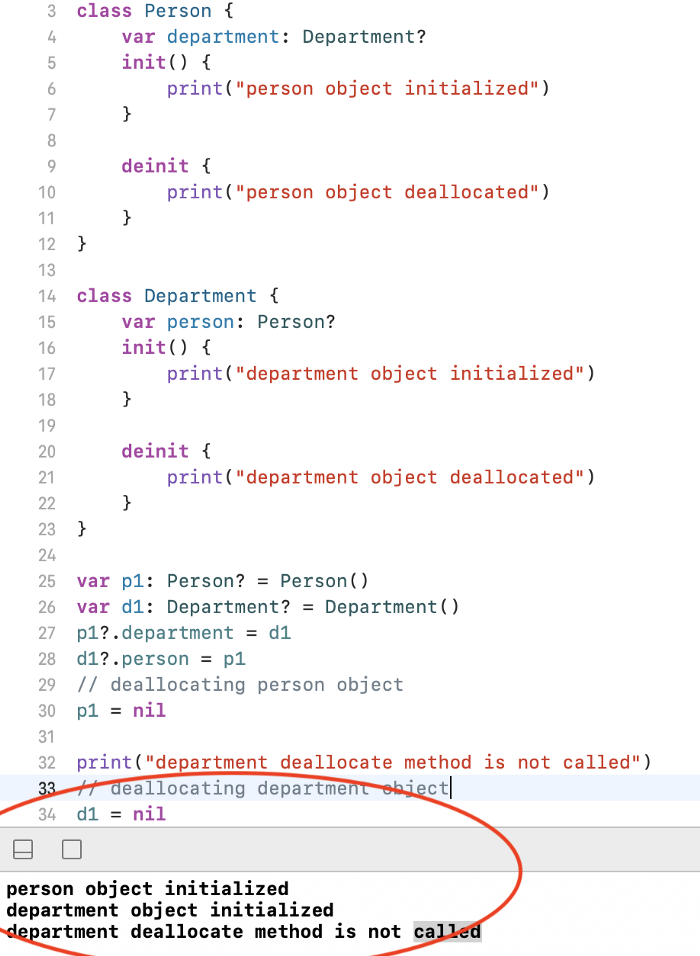
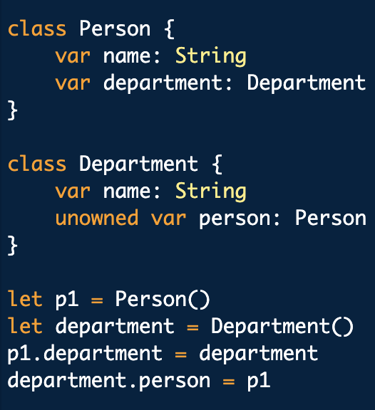
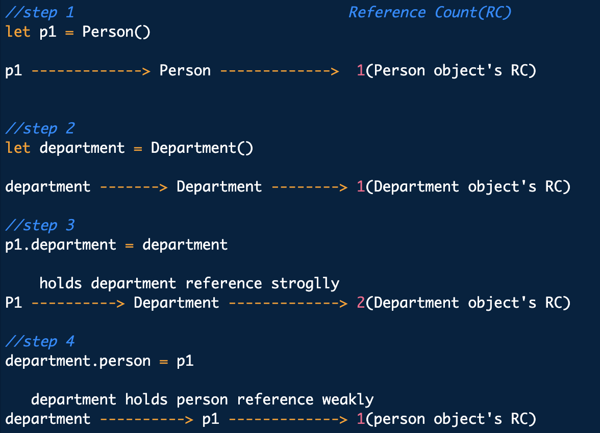
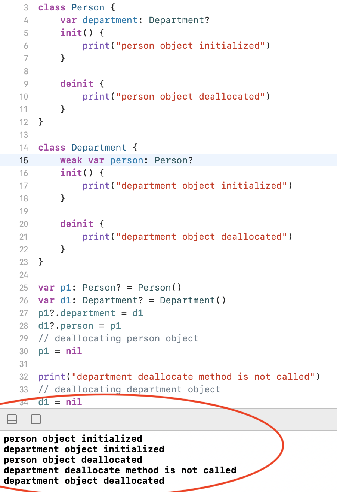
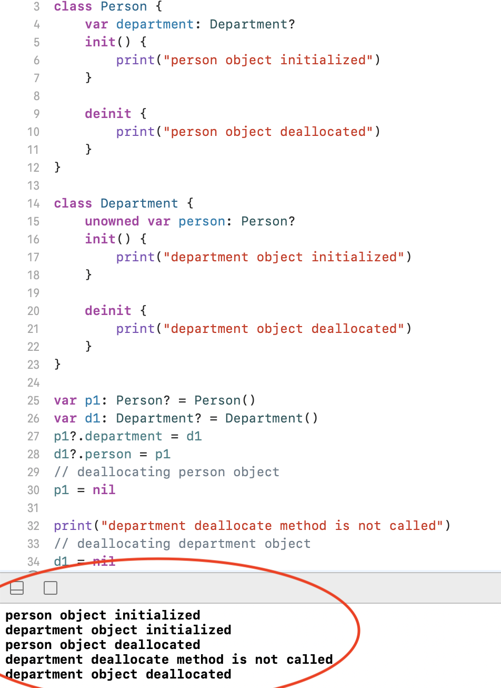
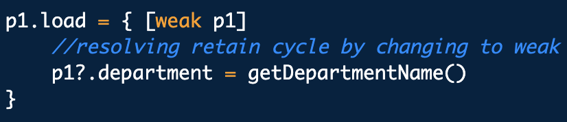

<h1>Memory management in Swift(Heap, Stack, ARC)</h1>
============================================

Swift sử dụng stack và heap để lưu trữ object. Quản lý bộ nhớ đề cập đến việc cấp phát và thu hồi một đối tượng.

Có hai mô hình quản lý bộ nhớ trong iOS.

1.  MRC : manual reference counting
2.  ARC: automatic reference counting

<h2>What is MRC?</h2>
------------

Ban đầu chúng ta đang sử dụng MRC mà không phải ARC, chúng ta cần giữ lại đối tượng và giải phóng đối tượng theo cách thủ công.

Trong mô hình này, chúng ta cần sử dụng 2 keywords đó là `retain` và `release` cho việc giữ object trong bộ nhớ và giải phón object khỏi bộ nhớ.

<h2>What is ARC?</h2>
------------

Hiện tại swift sử dụng ARC để tự động phân bổ và xử lý bộ nhớ. Với phương pháp này, bạn không cần phải sửa dụng `retain` và `release` nữa.

Khái niệm của ARC rất đơn giản, một đối tượng được giữ lại trong bộ nhớ bằng cách tăng lượng tham chiếu tới nó và sẽ được giải phóng khi giảm số lượng tham chiếu tới nó.

> Nếu số lượng tham chiếu trở thành 0, đối tượng đó sẽ được giải phóng khỏi bộ nhớ.

Trong swift, ta có 3 loại tham chiếu chính đó là  **strong**, **weak** and **unowned**.

<h2>Object's Lifetime</h2>
---------------------------

1.  **Allocation**: Lấy memory từ stack or heap.
2.  **Initialization**: `init` được chạy.
3.  **Usage**: Object được sử dụng.
4.  **Deinitialization**: `deinit` được chạy.
5.  **Deallocation**: Trả lại memory cho stack or heap.

<h2>Memory management issues</h2>
----------------------------------

1.  Giải phóng hoặc ghi đè dữ liệu khi đối tượng đang sử dụng. Nó gây ra crash or data corruption.
2.  Không giải phóng đối tượng nếu nó không được sử dụng. Nó dẫn đến memory leak.
3.  App crashes.

<h2>Memory leak</h2>
--------------------

Khi bộ nhớ được phân bổ cho đối tượng không được giải phóng mặc dù đối tượng sẽ không bao giờ được sử dụng lại, nó được gọi là memory leak. Nó xảy ra khi hai đối tượng tham chiếu lẫn nhau, khiến cho việc không thể bị giải phóng.

Memory leak trong ứng dụng gây ra hiệu suất hệ thống kém do tăng số lượng bộ nhớ.

<h2>Quy tắc chính trong memory management</h2>
-----------------------------------------

1.  Khi tạo đối tượng thì sau đó phải giải phóng đối tượng khi không sử dụng nữa.
2.  Sử dụng retain count để giải phóng và lưu trữ object trong bộ nhớ.
3.  Đừng giải phóng đối tượng nếu bạn không sở hữu đối tượng đó.

<h2>Làm thế nào đối tượng được lưu trữ và giải phóng trong bộ nhớ?</h2>
----------------------------------------------

**Strong references** sẽ làm tăng retain count, nó sẽ lớn hơn hoặc bằng 1, khi retain count bằng `zero`, object sẽ dược giải phóng khỏi bộ nhớ.

Ở ví dụ trên, ta tạo ra 2 class là person và department. Object Person được tạo và gán cho biến `p1` và Object Department được tạo và gán cho variable `department`.

Khi đối tượng Person được giải phóng, nó cũng tự động giải phóng các sub object. Vì vậy reference count của department cũng giảm xuống còn 1 khi đối tượng Person được giải phóng.

Khi đối tượng Person được giải phóng, method deinit của nó được gọi là method deinit của Department không được gọi vì số lượng giữ lại không bằng `zero`. Sau khi derpartment được gán bằng nil, retain count của nó bằng `zero` và giải phóng khỏi bộ nhớ.

Trong ví dụ trên, ta tạo 1 `person` giữ 1 tham chiếu tới `department` của nó và `department` cũng tham chiếu tới `person`.

When person được gán bằng nil. retain count của nó là 1 và khi department dược gán là nil, retain count của nó là 1.

Trong trường hợp này, retain count của cả 2 object đều nhiều hơn 1 và cả 2 đều tham chiếu tới nhau, dẫn tới không thể được giải phóng. Nó dẫn đến rò rỉ bộ nhớ. Tình huống này được gọi là retain cycle.

> Khi view controller được xóa. tất cả các view controller object sẽ được giải phóng. Bất kỳ sub object nào của object cũng sẽ được giải phóng khí nó được giải phóng.
>
> Note: Nếu 1 lớp khác có strong reference tới một object trong class thí cả lớp đó sẽ không được giải phóng.
Vì vậy nên sử dụng weak or unowned prorperties.

<h2>Retain cycle là gì?</h2>
--------------------------------------

Retain cycle xải ra khi 2 đối tượng đang tham chiếu tới nhau, khiến cho không thể giả phóng đối tượng - vì retain count của chúng luôn lớn hơn hoặc bằng 1.

How can you fix retain cycle?
-----------------------------

Đổi 1 trong tham chiếu về `weak` or `unowned` reference.

**Weak Reference**: Nó không làm tăng số lượng tham chiếu. weak reference luốn được khai vào là **optional type**.

**Unowned References**: giống với weak reference. Nó sẽ không làm tăng retain count khi được tham chiếu tới. Sự khác biệt chính là nó không phải là **optional type**. Nếu truy cập đến unowned property của 1 object đã deinit. Sẽ xảy ra lỗi runtime khi bạn cố force unwarp nil optional type.

Trong ví dụ trên, bạn có thể giải quyết strong reference bằng cách thay đổi weak or unowned reference trong lớp department.

Strong Reference Cycle in Closures:
-----------------------------------

Khi bạn sử dụng closures trong 1 instance class, chúng có khả năng ghi lại **self**. Từ đó sẽ có 1 tác động qua lại của strong reference giữa closure và class instance.

Đế tránh việc đó, ta cũng sẽ sử dụng `weak` or `unowned`.

<h2>Cách xác định memory leaks?</h2>
=================================

Xcode có tích hợp *memory graph debugger*. Nó giúp check được có bao nhiêu reference counts trong object và object nào đang tồn tại.

<h2>Heaps and Stacks</h2>
----------------

Swift tự động phân bổ bộ nhớ trong heap or stack.

Stack:
------

-   **Static** trong bộ nhớ và phân bổ chỉ xảy ra trong **compile time**.
-   stack là cấu trúc dữ liệu LIFO(Last in first out).
-   truy cập nhanh
-   Khi 1 function được gọi, tất cả các instance của function sẽ được đẩy vào stack hiện tại. Và một khi function được return, tất cả các instance sẽ được xóa khỏi stack.
-   Dữ liệu được lưu trữ trong stack chỉ là tạm thời cho đến khi hàm thực thi xong và khiến cho bộ nhớ trong stack được tự động giải phóng.
-   Mỗi scope trong ứng dụng (như nội dung trong method) sẽ được cung cấp bộ nhớ cần thiết.
-   stack không được sử dụng với các object thay đổi kích thước bộ nhớ.
-   Mỗi thread đều có ngăn xếp riêng.
-   Stacks struct lưu giữ value type ví dụ như struct và enum.
-   Nếu kích thước của value type của bạn có thể dược xác đinh trong compile time, or hoặc value type không chứa đệ quy hoặc không chứa bởi reference type, nó sẽ cần 1 stack allocation.
-   Value type không làm tăng retain count. nhưng nếu value type chứa reference type bên trong, bản copy của nó sẽ làm tăng reference count của nó.

Heap:
-----

-   **Dynamic** trong bộ nhớ và phân bổ xảy ra trong **runtime**.
-   Value có thể tham chiếu bất cứ lúc nào thông qua địa chỉ bộ nhớ.
-   không giới hạn size bộ nhớ.
-   truy cập chậm.
-   Khi process yêu cầu một bộ nhớ nhất định, heap sẽ tìm kiếm địa chỉ bộ nhớ đáp ứng yêu cầu và trả về cho nó.
-   Khi bộ nhớ không còn được sử dụng nữa, process phải báo lại với heap về bộ nhớ trống đó.
-   Yêu cầu thread safety.
-   heap được chia sẻ với tất cả.
-   Nếu size của value type không thể xác định trong compile tim (do protocol/generic requirement), hoặc value type chứa đệ quy / chứa một reference type (lưu ý là closure cũng là 1 reference types), nó sẽ cần 1 heap allocation.
-   class được lưu trữ trong heap memory.

> Heap Allocation chậm hơn Stack Allocation không chỉ vì cấu trúc dữ liệu phức tạp hơn --- nó còn bởi vì thread safety. Mỗi thread đều có 1 stack riêng nhưng heap được chia sẽ cho tất cả vì vậy nó yêu cầu đồng bộ hóa.

Interview tricky questions?
---------------------------

1\. What happens when we execute below code?

Ans: Object will be allocated and deallocated immediately and you can't refer that object again. Bellow is simple example:

2\. Why IBOutlets are weak. What happen if you use strong references?

If you declare IBOutlets as strong or weak, your application won't crash and burn. Every view controller keeps a reference to the view it manages. That reference is strong. The view should not be deallocated as long as the view controller is alive.

That VC's view always keeps a strong reference to the subviews it manages. That makes sense because the subviews is still alive and visible even if we don't declare an outlet for the subviews in the `ViewController` class.

As per ARC: When the view controller is deallocated, the view it manages is deallocated as well. This also means that any subviews the view manages are also deallocated.

The view heirarchy already has a strong reference. so assigning weak to IBoutlets might help to avoid reference cycles when your dismissing the view controller.

As of 2015, recommended best practice from Apple was for IBOutlets to be strong unless weak is specifically needed to avoid a retain cycle.